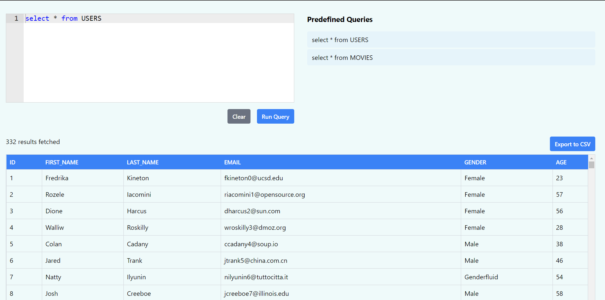
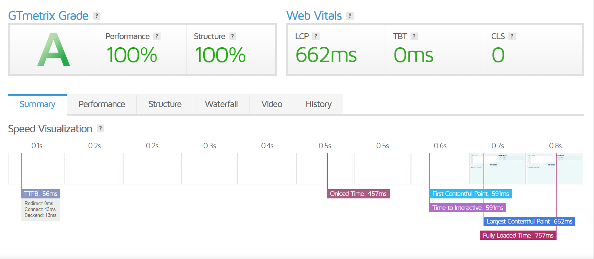
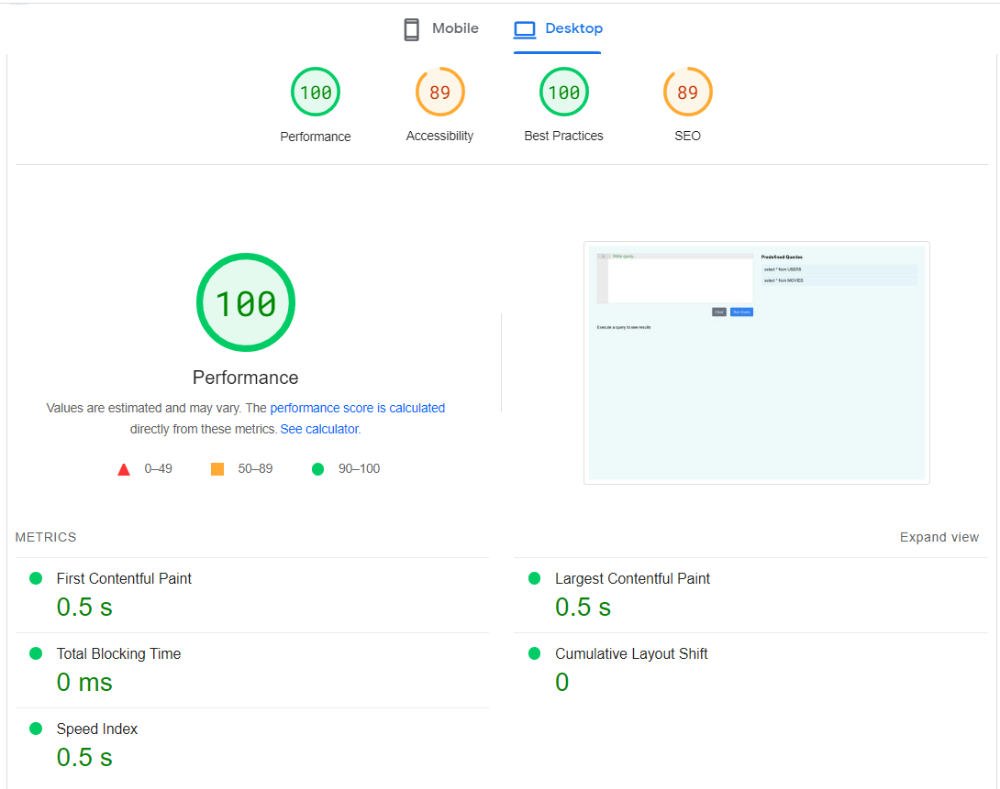
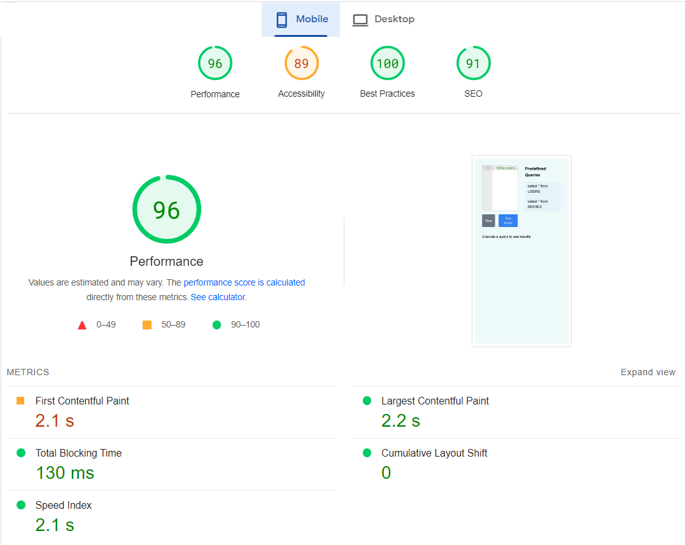

# React SQL Editor v1
## [Hosted on vercel: https://pranayan-react-sql-editor-v1.vercel.app/](https://pranayan-react-sql-editor-v1.vercel.app/)

This is a lightweight version of the app. It has only the basic functionalities and focus was on making use of as little libraries as possible to try to improve performance

## Project Overview

On the top left, the editor is present with two buttons:

- Run Query: submits the query written in the editor
- Clear: empties the editor

On the top right, 2 predefined queries are given. Clicking on them will populate the editor with those queries, and on running them corresponding data will be shown

On the bottom is the output section.
- It shows the data in table format.
- The table itself is scrollable, so you don't have to lose sight of the query while going through the results.
- On the top it mentions the number of rows of data present
- Also has a button to export the data in the table as a CSV file

## Frameworks and libraries used
- ReactJS with Vite : Vite provides a smaller bundle size thus making the app slightly lighter and faster than create-react-app
- TailwindCSS : to easily add styles without having to write large CSS files
- react-ace : the text editor to enter SQL commands
- react-csv : to allow downloading data in CSV format

## Performance Metrics

GTMetrix:

Pagespeed:

## Optimisation Attempts

- Used vercel for hosting leverage its Vercel Edge Network compression that results in the better performance.
- Lazy loaded output section since it's required only after user interacts with site
- separated the components and added the data fetching responsibilities in lazy loaded component